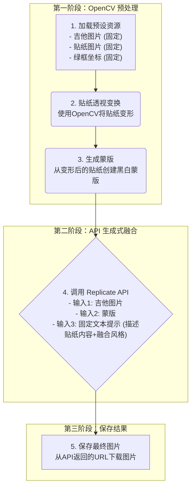

# Demo 工作流程 (OpenCV 预处理 + Replicate API)

根据我们对细节的讨论，以下是更新后的、更精确的 Demo 工作流程。

### 关键细节澄清

1.  **绿框坐标**: 我们将在代码中硬编码一组稍稍**位于吉他轮廓内部**的坐标，以确保蒙版不会超出边界，从而获得最干净的生成效果。

2.  **文本提示 (Prompt) 策略**:
    *   **目标**: 我们的目标不是让 AI 自由创作，而是让它**“复刻”**我们预设的贴纸 (`sticker.png`)，并将其**逼真地“融合”**到吉他表面。
    *   **实现**: 由于 AI 看不到 `sticker.png` 的内容，我们必须通过一个固定的、高质量的文本提示来指导它。这个提示必须包含两部分：
        *   **内容描述**: 精确描述 `sticker.png` 的内容。例如，如果贴纸是一条龙，提示就应该包含 `A detailed black dragon sticker`。
        *   **风格指令**: 强制 AI 专注于融合，而不是创作。例如，加入 `photorealistic, seamlessly blended, matching the ambient light and surface texture`。
    *   **最终示例提示**: `"A detailed black dragon sticker on a white electric guitar, photorealistic, seamlessly blended, matching the ambient light and surface texture of the guitar body."`
    *   通过这种方式，我们利用 Prompt 来约束 AI，使其行为尽可能地接近“智能粘贴”，而不是“随心作画”。 